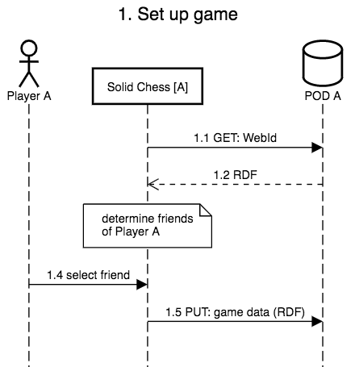
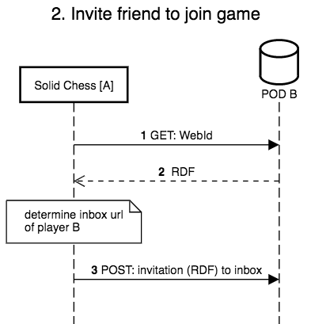
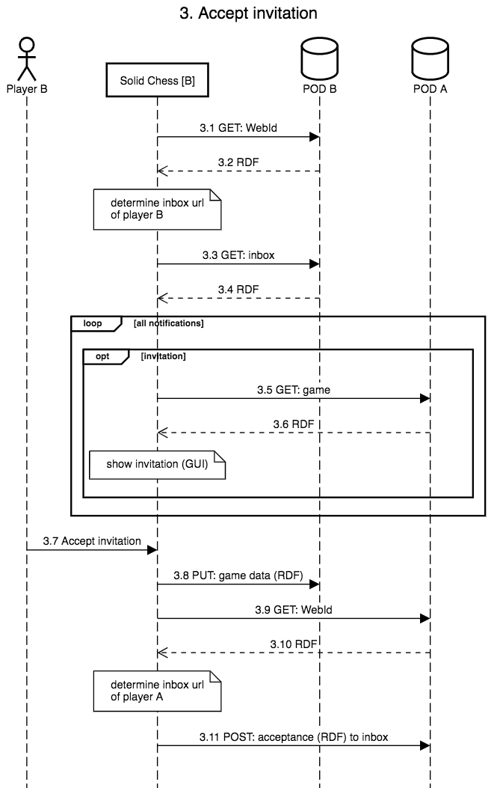
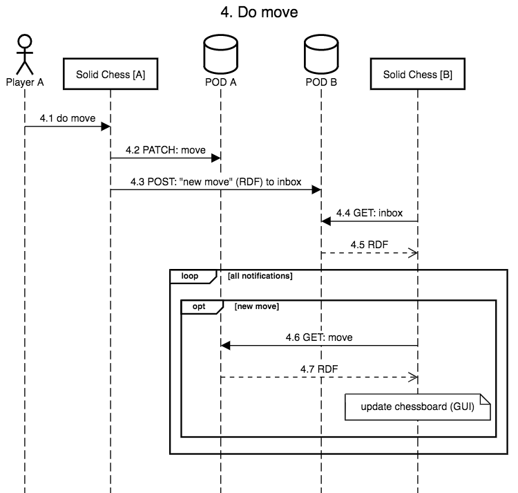

# How Solid Chess interacts with Solid PODs

We discuss how Solid Chess interacts with the different Solid PODs of the players.
In our example, we have two players, A and B, and have a closer look at the following four steps:

1. Player A sets up a new game
2. Player A invites a friend (Player B) to join the game
3. Player B accepts the invitation
4. Player A does a move

## Set up game

Player A is logged in and has the application loaded (Solid Chess [A] in Fig. 1).
We need some details to set up a new chess game.
One of these things is the friends of Player A.
That way, he can select against who he wants to play.
First, we do a GET of the WebId of Player A (see Fig. 1.1).
Note that we know the WebId of Player A, because he logged into his POD (POD A in Fig.1 ).
The response of the GET is an RDF document which contains the WebIds of Player A's friends (see Fig. 1.2).
Next, Player A selects the desired friend (see Fig. 1.3).
Finally, we store the game data (RDF) on the POD of Player A (see Fig. 1.4).

## Invite friend to join game

After the game is set up, we need to send an invitation to our friend, Player B, to join the game.
This is done by sending a notification to the inbox of Player B.
Therefore, we do a GET of the WebId of Player B (see Fig. 2.1).
The response of the GET is an RDF document which contains the url of the inbox of Player B (see Fig. 2.2).
We send an invitation (RDF) to the inbox, which is located on his POD (POD B), via a POST (see Fig. 2.3).

## Accept invitation

Player B opens a chess application, which does not need be the same one as Player A.
We need to find out if any invitation for a chess game arrived.
We only know the WebId of Player B, because he logged into his POD (POD B).
Therefore, again we do a GET of this WebId (see Fig. 3.1) and inspect the returned RDF (see Fig. 3.2) to find the inbox.
We do a GET of the inbox (see Fig. 3.3) and iterate over all notifications which can be found in the returned RDF (see Fig. 3.4).
If we encounter an invitation, we do a GET of the url of the game to fetch the details (RDF) of the game (see Fig. 3.5 and 3.6).
We show every invitation in the application.
Player B decides to accept the invitation.
We store the relevant game data also on the POD of Player B (see Fig. 3.8).
Next, we want to let Player A know that Player B accepted the invitation.
Therefore, we need to send a notification to the inbox of Player A (see Fig. 3.9 - 3.11).
This is similar to sending an invitation to Player B.

## Do move

After Player A saw that Player B accepted his invitation, he does his first move (see Fig. 4.1).
We need to store this new move on our POD (see Fig. 4.2).
Next, we need to notify Player B that a new move has been made.
Therefore, we send a notification to his inbox (see Fig. 4.3).
The new move needs to be shown in the application.
We get all notifications in the inbox (see Fig. 4.4 and 4.5) and iterate over them.
If we encounter a notification of a new move, we get the details (RDF) of the move (see Fig. 4.6 and 4.7).
The chessboard is updated with the new move.