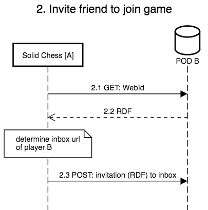

# Data flow

We discuss how the data flows between the applications and the different Solid PODs of the players.
In our example, we have two players, A and B, and have a closer look at the following four steps:

1. Player A sets up a new game
2. Player A invites a friend (player B) to join the game
3. Player B accepts the invitation
4. Player A does a move

## Set up game

## Invite friend to join game

## Accept invitation

## Do move

